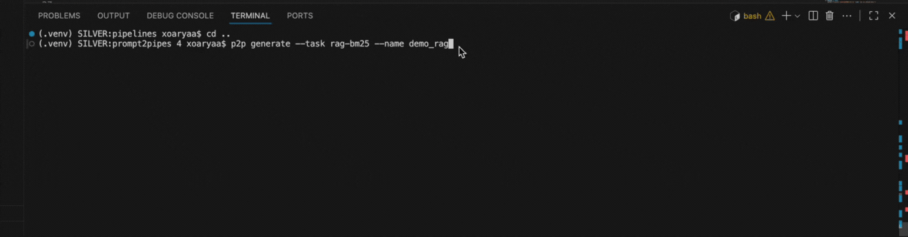

# Prompt2Pipes (P2P) — Natural-Language → NLP Pipelines
<p align="center">
  
</p>

This repo is a learning-first, hands-on scaffold to build a CLI that turns plain English specs
into runnable NLP pipeline graphs, validates them, and executes two runners:
- spaCy NER
- RAG with BM25 (TXT/PDF loader, splitter, retriever, naive reader)

## 📦 Install (editable dev)
```bash
python -m venv .venv && source .venv/bin/activate  # Windows: .venv\Scripts\activate
pip install -U pip
pip install -e .
p2p --help
```

## 🧭 Quick Start
```bash
p2p init
# NER
p2p generate --task ner --name demo_ner
p2p validate pipelines/demo_ner.yaml
p2p explain pipelines/demo_ner.yaml
python -m spacy download en_core_web_sm
p2p run pipelines/demo_ner.yaml --text "Sachin Tendulkar lives in Mumbai and played for India."

# RAG
p2p generate --task rag-bm25 --name demo_rag
p2p validate pipelines/demo_rag.yaml
p2p explain pipelines/demo_rag.yaml
pip install rank-bm25 pypdf
p2p run pipelines/demo_rag.yaml --query "Where is Apple expanding in India?" --docs_path data/docs --top_k 3
```

## 🧠 Learning checkpoints
- IR modeling (nodes/edges/types)
- CLI ergonomics (Typer + Rich)
- Static validation (acyclic graph; endpoint checks)
- Execution: topological sort + runtime registry
- RAG concepts: loading, chunking, indexing, retrieval, naive reading
- Extensibility: params, overrides, new components

## 🗂 Repo layout
```
prompt2pipes/
├── pyproject.toml
├── src/prompt2pipes/
│   ├── __init__.py
│   ├── cli.py
│   ├── ir.py
│   ├── generator.py
│   ├── validator.py
│   ├── visualize.py
│   ├── runner.py
│   └── templates/
│       ├── ner.yaml
│       └── rag_bm25.yaml
├── data/
│   ├── sample_text.txt
│   └── docs/
│       ├── mumbai_tech.txt
│       └── apple_india.txt
├── artifacts/
└── tests/
    └── test_ir.py
```
